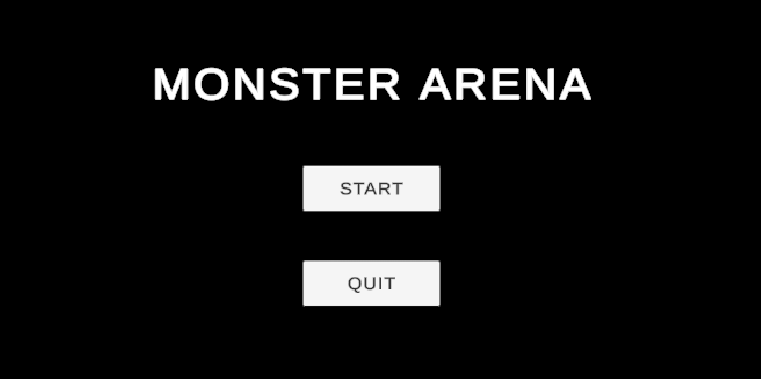
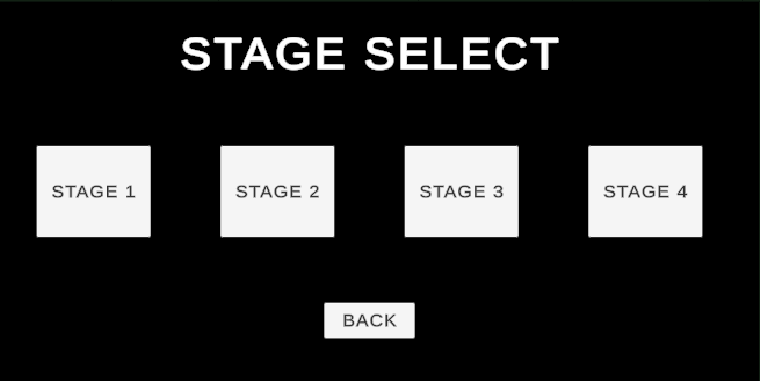
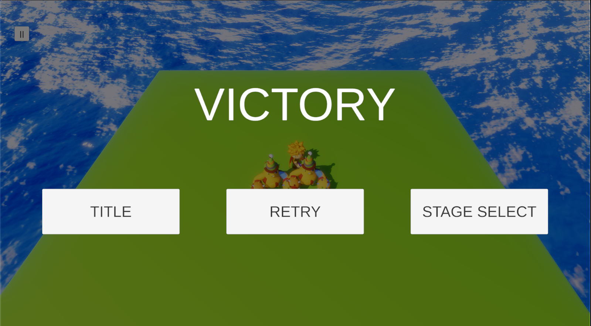

# 플밍 4기 팀 프로젝트

## 🎮 Monster Arena

---

## 📋 개요

* **장르**: `2.5D PvE Battle`
* **플레이타임**: 약 10분
* **개발 환경**: `Unity 2022.3.62f2`
* **플랫폼**: `Windows`
* **프로젝트 기간**: 2026.01.28 ~ 2026.02.03 (1주일)

---

## 👤 팀원 (Team)

* 김경민
* 조경민
* 이상훈
* 손지원
* 이종현

---

## ✨ 게임 특징 (Features)

4개의 스테이지로 구성되어 있으며, 각 스테이지에서 등장하는 몬스터와 싸우는 방식으로 진행된다. 

---

### ⚔️ 능력치 및 스킬 정보

#### 1. 플레이어 (Player)

* **기본 체력**: 300 HP

한 번에 하나의 공격만 수행 가능

| 스킬명 | 단축키 | 데미지 | 쿨타임 | 상태 이상 (스턴) |
| --- | --- | --- | --- | --- |
| **찌르기** | `J` | 25 | 0.2초 | X |
| **베기** | `K` | 20 | 0.2초 | X |
| **회전** | `L` | 30 | 5초 | **2초 스턴** |

#### 2. 몬스터 (Monster)

* **기본 체력**: 100 HP

| 구분 | 특징 및 공격 방식 |
| --- | --- |
| **공격 로직** | 모든 공격에는 개별 쿨타임이 존재함 |
| **행동 패턴** | 사용 가능한 공격 중 확률에 따라 하나를 선택하여 수행 |
| **다양성** | 공격의 종류와 수치는 몬스터 타입에 따라 상이함 |

### 1. 핵심 메커니즘 1: [몬스터 로직]

* 추격 알고리즘과 공격 상태머신이 구현된 몬스터

### 2. 핵심 메커니즘 2: [공격별 쿨타임 적용]

* 다양한 공격마다 쿨타임 따로 적용

### 2. 핵심 메커니즘 3: [이동 영역 제한]

* 맵 밖으로 탈출하지 못하도록 제한 

---

## 🕹️ 플레이 방법 (Controls)

| 동작 | 키 바인딩 |
| --- | --- |
| **이동** | `W`, `A`, `S`, `D` |
| **찌르기** | `J` |
| **베기** | `k` |
| **회전** | `J` |

---

## 💻 실행 환경 (Environment)

* **Engine**: Unity 2022.3.62f2
* **Platform**: Windows 10/11
* **Resolution**: 1920 x 1080 (Recommended)

---

## 🤝 협업 관리 (Management)

* **Notion**: [노션](https://www.notion.so/1-2f51c30b8ab380fc9888fe86cf2c8a82?source=copy_link)
* **Version Control**: Git (GitHub Desktop)
* **Communication**: Discord / Zep Meeting
